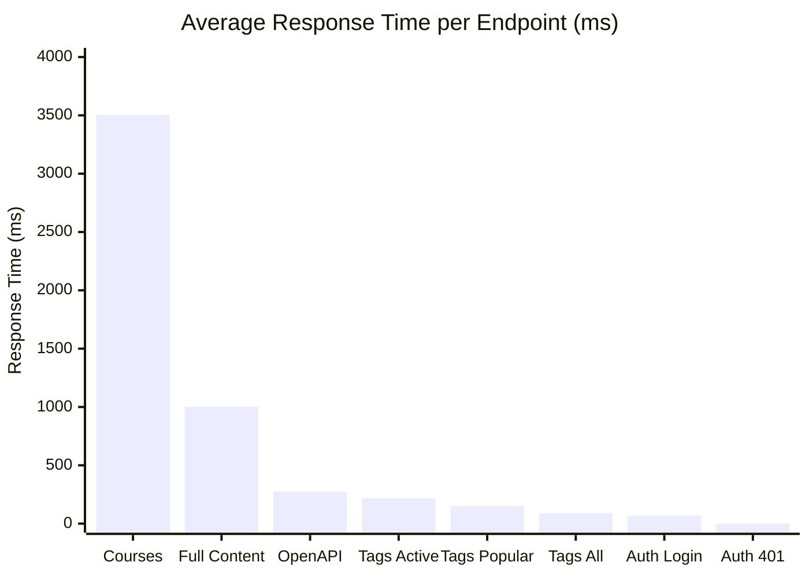
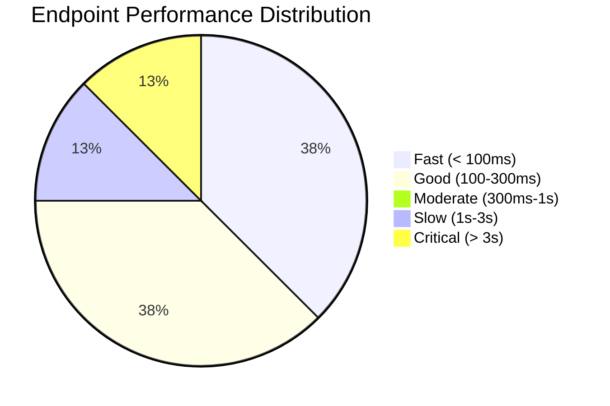
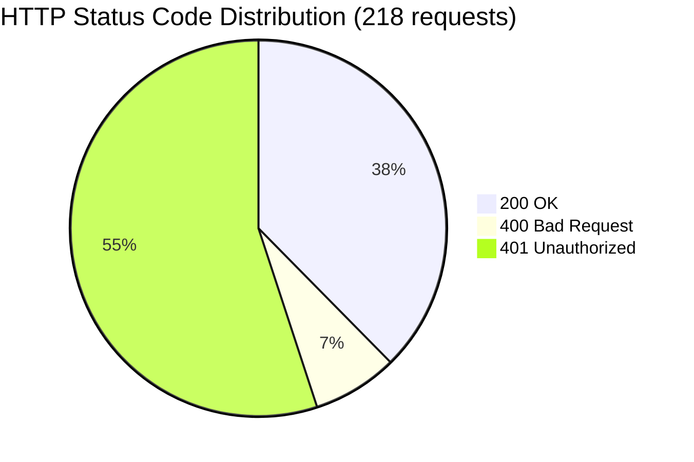
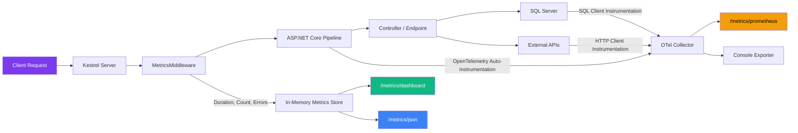

# Neura API — Performance Metrics for Presentation

---

## Slide 1: Overview — Key Numbers

| Metric | Value |
|--------|-------|
| **Total Endpoints Tested** | 13 |
| **Total Requests Fired** | 218 |
| **Concurrent Users Simulated** | 5 |
| **Fastest Response** | 0.3ms (Auth middleware rejection) |
| **Slowest Response** | 7,400ms (Courses listing P99) |
| **Average Response (Public APIs)** | 1,030ms |
| **Average Response (Auth APIs)** | 70ms |
| **Uptime During Test** | 100% |
| **Server Errors (5xx)** | 0 |

---

## Slide 2: Endpoint Response Times

| Endpoint | Avg (ms) | P50 (ms) | P95 (ms) | P99 (ms) | Requests |
|----------|----------|----------|----------|----------|----------|
| `GET /api/Courses` | 3,504 | 2,968 | 7,367 | 7,400 | 21 |
| `GET /api/Courses/full-content` | 1,002 | 899 | 2,735 | 2,735 | 20 |
| `GET /openapi/v1.json` | 276 | 275 | 333 | 333 | 20 |
| `GET /api/Tags/active` | 217 | 222 | 269 | 269 | 20 |
| `GET /api/Tags/popular` | 152 | 177 | 202 | 202 | 20 |
| `GET /api/Tags` | 89 | 84 | 138 | 138 | 20 |
| `POST /Auth/login` | 70 | 70 | 78 | 78 | 10 |
| Auth Middleware (401) | 0.3 | 0.3 | 0.6 | 0.6 | 100 |

---

## Slide 3: Response Time Comparison (Bar Chart)

---

## Slide 4: Performance Tiers

| Tier | Endpoints | Response Range |
|------|-----------|---------------|
| 🟢 **Fast** | Tags All, Auth Login, Auth 401 | < 100ms |
| 🟢 **Good** | Tags Active, Tags Popular, OpenAPI | 100–300ms |
| 🟡 **Slow** | Courses Full Content | 1,002ms avg |
| 🔴 **Critical** | Courses Listing | 3,504ms avg |

---

## Slide 5: Status Code Distribution

| Status Code | Count | Meaning |
|-------------|-------|---------|
| **200** OK | 82 | Successful responses |
| **400** Bad Request | 16 | Invalid login credentials (expected) |
| **401** Unauthorized | 120 | Auth-required endpoints without token (expected) |
| **500** Server Error | 0 | No server crashes |

---

## Slide 6: P95 Latency (Tail Performance)

| Endpoint | P95 Latency | Status |
|----------|-------------|--------|
| `GET /api/Courses` | 7,367ms | 🔴 Needs optimization |
| `GET /api/Courses/full-content` | 2,735ms | 🟡 Monitor |
| `GET /openapi/v1.json` | 333ms | 🟢 Acceptable |
| `GET /api/Tags/active` | 269ms | 🟢 Good |
| `GET /api/Tags/popular` | 202ms | 🟢 Good |
| `GET /api/Tags` | 138ms | 🟢 Good |
| `POST /Auth/login` | 78ms | 🟢 Excellent |

---

## Slide 7: Observability Architecture

---

## Slide 8: What We Monitor

| Category | Metrics Collected |
|----------|-------------------|
| **HTTP Requests** | Duration, Count, Error Rate, Active Requests |
| **Per Endpoint** | Avg, P50, P95, P99, Min, Max response times |
| **Status Codes** | Distribution of 2xx, 3xx, 4xx, 5xx per route |
| **SQL Queries** | Query duration, query text, exceptions |
| **HTTP Client** | Outgoing call duration and status |
| **Authentication** | Auth duration per scheme |
| **Memory** | Pool allocation, eviction, rented bytes |
| **Routing** | Match attempts, success/failure rate |

---

## Slide 9: Test Configuration

| Parameter | Value |
|-----------|-------|
| **Tool** | Custom PowerShell stress test |
| **Requests per endpoint** | 20 |
| **Concurrent users** | 5 |
| **Timeout** | 30 seconds |
| **Target** | `http://localhost:5017` |
| **Database** | Remote SQL Server (databaseasp.net) |
| **Framework** | .NET 10 / ASP.NET Core |
| **Observability** | OpenTelemetry SDK 1.16.0 |

---

## Slide 10: Recommendations

| Priority | Issue | Recommendation |
|----------|-------|----------------|
| 🔴 **High** | `/api/Courses` — 3.5s avg | Add response caching, optimize EF Core queries, add pagination limits |
| 🟡 **Medium** | `/api/Courses/full-content` — 1s avg | Add `[ResponseCache]`, consider lazy loading sections |
| 🟢 **Low** | Tags endpoints — 90-220ms | Already within acceptable range |
| ✅ **Done** | No observability | OpenTelemetry + Dashboard + Prometheus now integrated |
